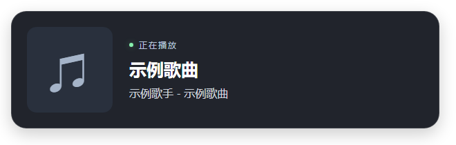

# OBS Live Overlay

一个用于 OBS Browser Source 的实时等候队列。通过本地控制台管理队列、提示消息和文字样式，画面会实时同步到 OBS。

## 界面预览

### 控制台


### OBS Overlay


### 音乐 Overlay



## 安装

需要 Node.js 20 或更高版本。

```bash
npm install --global @leejkee/obs-live-overlay
```

## 使用

在终端启动：

```bash
obs-live-overlay
```

启动后打开：

- 统一控制台：<http://127.0.0.1:3000/control>
- 队列 Overlay：<http://127.0.0.1:3000/overlay/queue>
- 音乐 Overlay：<http://127.0.0.1:3000/overlay/music>

将 Overlay 地址添加为 OBS 的 Browser Source。页面背景透明，可以直接叠加到直播画面。控制台支持点击选择用户并通过上下箭头调整顺序；指定当前用户时会将其移到队首。显示文案和字体样式也可实时修改；按 `Ctrl+C` 停止服务。

### 常用选项

```text
obs-live-overlay --port 3000
obs-live-overlay --host 127.0.0.1
obs-live-overlay --data-file D:\overlay-data\profiles.json
obs-live-overlay --music-settings-file D:\overlay-data\music.json
obs-live-overlay --help
obs-live-overlay --version
```

Windows 默认数据文件位于 `%LOCALAPPDATA%\obs-live-overlay\profiles.json`。

### Windows 静默启动

Windows 11 可以将服务注册为登录后自动运行的计划任务。启用时会请求一次管理员授权：

```bash
obs-live-overlay startup-enable
```

查看状态：

```bash
obs-live-overlay startup-status
```

停止服务并取消自动启动：

```bash
obs-live-overlay startup-disable
```

静默启动固定使用 `127.0.0.1:3000` 和默认数据文件。全局卸载或更换 Node.js 安装位置前，请先运行 `startup-disable`；更换后可重新启用。

## Windows SMTC 原生接口

项目提供可通过 `require('@leejkee/obs-live-overlay/native')` 加载的媒体会话接口，支持 Windows 10 1809+ / Windows 11 x64。包含会话读取、事件订阅、播放状态和封面读取；音乐页面通过主服务中的音乐观察服务读取媒体会话。

TypeScript 用法、接口契约和原生构建步骤见 [SMTC 开发文档](docs/node-addon.md)。源码开发先运行 `npm run build:native` 和 `npm run build`；发布包使用随包预编译二进制。

## 卸载

```bash
obs-live-overlay startup-disable
npm uninstall --global @leejkee/obs-live-overlay
```

卸载不会删除队列数据。如需完全清理，请手动删除默认数据文件。

## 开发文档

项目架构与实现说明见 [设计文档](docs/design.md)，版本发布流程见 [Release 规则](RELEASE.md)。

## 音乐 Overlay（只读）

源码开发首次使用前运行 `npm run build:native` 和 `npm run build`，然后统一启动队列与音乐服务：

```bash
npm start
```

在 OBS 添加第二个浏览器源，URL 为 `http://127.0.0.1:3000/overlay/music`，建议尺寸 **660 × 210**。背景透明，显示歌曲名称、歌手名称 - 歌曲名称、封面及播放状态，约每秒更新一次。QQ 音乐需要已经运行并向 Windows 提供媒体会话。

优先观察 QQ 音乐（包括暂停状态）；未发现 QQ 音乐时使用 Windows 当前会话，再回退到其他播放会话。识别依据是系统提供的来源 ID 中包含 `QQMusic` 或 `QQ音乐`。

音乐与队列由同一个 CLI 进程和同一个 HTTP 服务统一启动，默认使用 3000 端口，通过 `/overlay/queue` 与 `/overlay/music` 区分页面。可用 `npm start -- --port 3100` 或环境变量 `PORT` 修改统一端口。Windows 静默启动也会同时启动两项功能；按 Ctrl+C 或执行 `startup-disable` 会关闭服务和音乐观察者，不影响播放器。

页面没有播放器控制按钮；切歌、暂停和进度操作均在 QQ 音乐本体完成。无会话、暂停及服务断开时会显示对应状态；音乐信息不写入队列 Profile。

### 音乐控制台

统一启动后访问 `http://127.0.0.1:3000/control`，通过左侧导航在“等候队列”和“正在播放”之间切换；也可用 `http://127.0.0.1:3000/control?view=music` 直接打开音乐设置：

- **启用音乐服务**：关闭时停止 SMTC 监控、释放订阅并隐藏 OBS 音乐画面；控制台保留，可随时重新开启。不会暂停或关闭 QQ 音乐。
- **显示模块**：歌曲封面、播放状态、歌曲名称、歌手名称 - 歌曲名称分别设置开关，全部关闭时隐藏整个卡片。
- **编辑字体**：为两行文字分别设置字体、字号、加粗、对齐、颜色和描边，复用队列字体编辑器，修改自动保存，约一秒内同步到预览和 OBS。

首次启动默认启用，后续启动恢复保存的开关与样式。Windows 默认配置文件为 `%LOCALAPPDATA%\obs-live-overlay\music.json`，可用 `MUSIC_SETTINGS_FILE` 或 `npm start -- --music-settings-file <音乐配置路径>` 指定，与队列 Profile 独立。开启失败时控制台显示错误，可关闭后重新开启；关闭后的画面完全透明。
