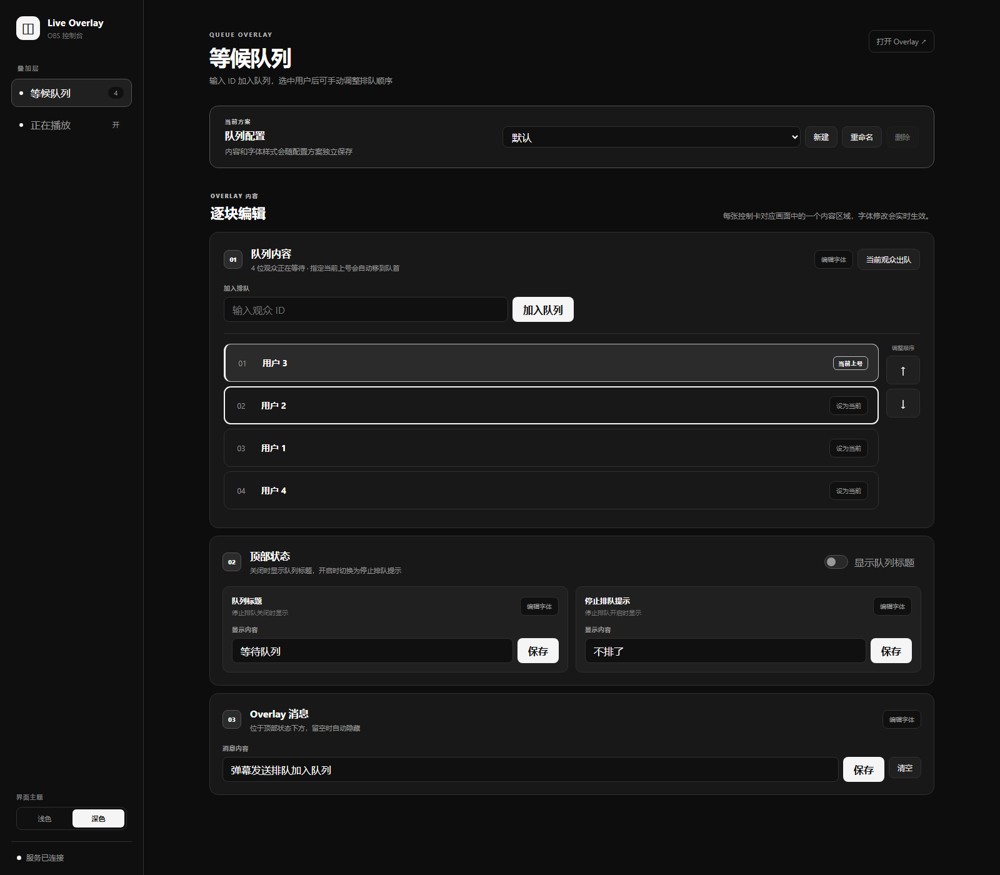
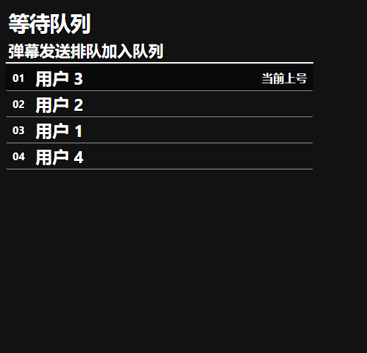

# OBS Live Overlay

一个用于 OBS Browser Source 的实时等候队列。通过本地控制台管理队列、提示消息和文字样式，画面会实时同步到 OBS。

## 界面预览

### 控制台



### OBS Overlay



Overlay 使用透明背景，可直接叠加到直播画面。

## 安装

需要 Node.js 20 或更高版本。

```bash
npm install --global @leejkee/obs-live-overlay
```

## 使用

安装后在终端启动：

```bash
obs-live-overlay
```

然后打开：

- 控制台：<http://127.0.0.1:3000/control>
- OBS Overlay：<http://127.0.0.1:3000/overlay/queue>

在控制台中添加观众、指定当前上号用户、完成当前用户出队、显示提示消息，并调整各区域的字体、字号、颜色和描边。指定当前用户不会改变原有排队顺序，适合临时跳过不在场的观众。控制台支持浅色、深色主题，选择会保存在当前浏览器中。将 OBS Overlay 地址添加为 OBS 的 Browser Source；页面背景透明，可直接叠加到直播画面。

服务以前台方式运行，按 `Ctrl+C` 停止。

### 常用选项

```text
obs-live-overlay --port 3000
obs-live-overlay --host 127.0.0.1
obs-live-overlay --data-file D:\overlay-data\profiles.json
obs-live-overlay --help
obs-live-overlay --version
```

Windows 默认数据文件位于 `%LOCALAPPDATA%\obs-live-overlay\profiles.json`。使用 `--data-file` 可以指定其他保存位置。

## 卸载

```bash
npm uninstall --global @leejkee/obs-live-overlay
```

卸载不会删除已经保存的队列数据。如需完全清理，可在卸载后手动删除数据文件。

## 源码开发

```bash
git clone https://github.com/leejkee/obs-live-overlay.git
cd obs-live-overlay
npm install
npm run dev
```

开发服务默认使用与正式命令相同的地址。修改代码后可运行：

```bash
npm run verify
```
