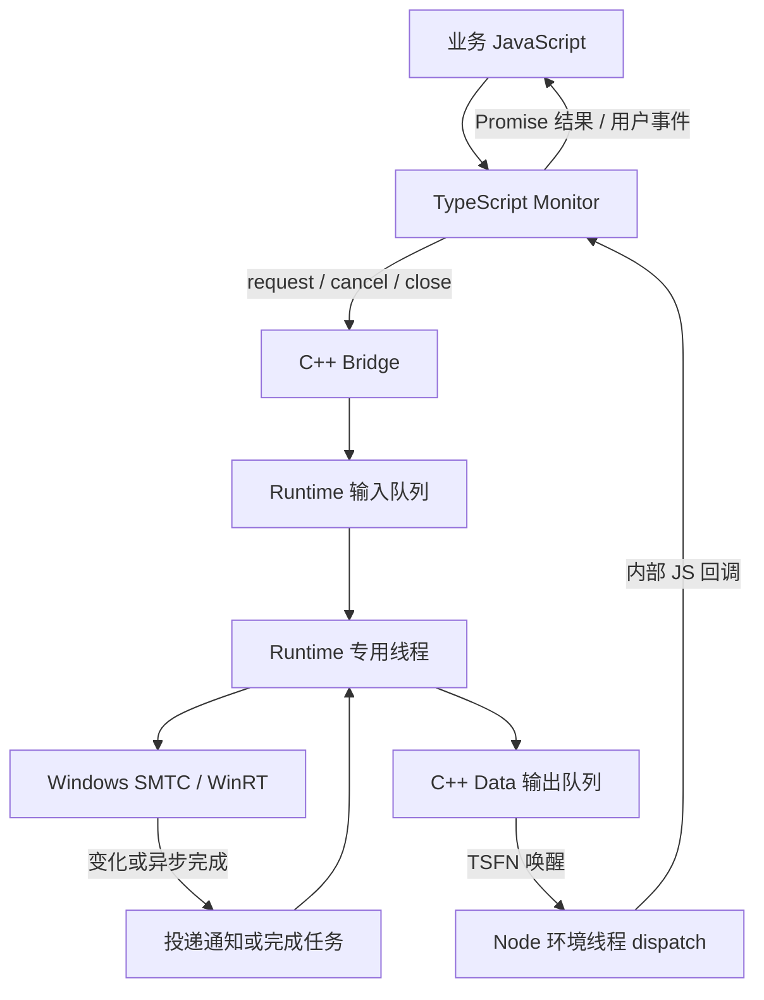
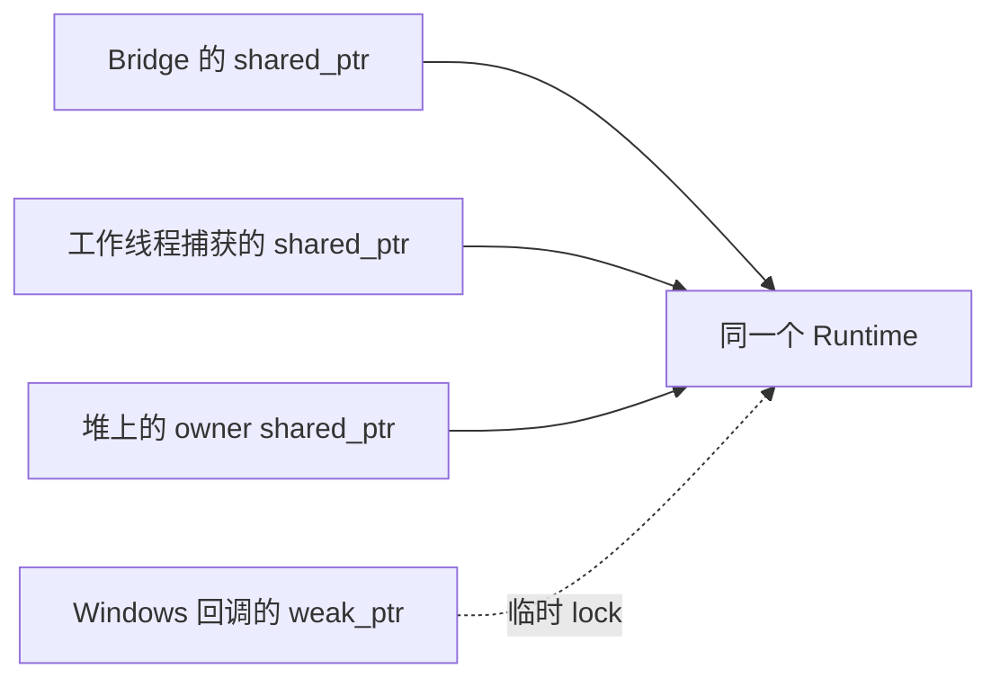

# 从 Node.js 到 Windows：原生插件实现思路

本文面向不了解 Node-API 的读者，解释这个插件为什么拆分成几个类、需要维护哪些对象的生命周期，以及 C++ 最终如何与 Node.js 通信。接口用法、构建方式和错误契约见 [Windows SMTC 原生扩展](node-addon.md)。

主要代码位置：

- [native/index.cjs](../native/index.cjs)：加载原生模块，连接 TypeScript 和 C++。
- [src/native/monitor.cts](../src/native/monitor.cts)：管理公共接口、Promise、状态缓存和用户事件。
- [src/native/addon.cpp](../src/native/addon.cpp)：访问 Windows 媒体接口，执行跨线程通信和原生资源清理。

## 1. 插件要解决什么问题

Windows 的系统媒体传输控件（SMTC）可以告诉我们有哪些媒体会话、正在播放什么、播放进度如何，本项目通过 Windows 的 WinRT 接口只读取这些信息，不向播放器发送控制命令。

Node.js 中的 JavaScript 需要一个入口调用这些原生接口，因此项目把 C++ 编译成 `.node` 文件，由 Node.js 加载。加载后，JavaScript 和 C++ 位于同一个进程中，通过函数调用和内存中的消息队列交换数据。

难点在于，两边的执行方式和生命周期不同：

- JavaScript 对象由垃圾回收器管理，业务通常通过 Promise 等待异步结果。
- Windows 对象、订阅和异步操作需要原生代码维护；取消操作或撤销订阅时，可能仍有回调正在执行。
- C++ 工作线程不能随意创建 JavaScript 对象或直接调用 JavaScript 函数。
- Node.js 退出或 Worker 被终止时，原生工作也必须安全结束。

因此，实现既要处理“执行请求”，也要处理“请求结束之前，相关对象还能不能使用”。

## 2. 先认识 Node-API 和执行线程

Node-API 是 Node.js 提供给原生扩展的一组接口，用于创建 JavaScript 值、导出函数、调用 JavaScript 回调以及参与环境清理。代码中的 `Napi::ObjectWrap` 等类型来自 node-addon-api，是对 Node-API 的 C++ 封装；部分通信和清理代码直接使用 `napi_*` 接口。

这里的 Node 环境可以理解为“一套运行 JavaScript 的上下文及其资源”。普通入口属于主线程的环境；如果在 Node Worker 中加载插件，则属于那个 Worker 的环境。下文说的“Node 环境线程”，指拥有这套环境的线程，不一定是整个进程的主线程。

本项目主要涉及三类执行位置：

| 执行位置 | 负责的事情 |
| --- | --- |
| Node 环境线程 | 运行 TypeScript、处理 JS 调用、创建 JS 值、交付结果和事件 |
| Runtime 专用线程 | 初始化 WinRT 的 MTA 环境，串行管理媒体会话、请求和原生资源 |
| Windows 异步回调线程 | 收到变化或完成通知，将工作投递回 Runtime |

MTA 是 Windows 的一种 COM 线程模型。这里先把它理解为“工作线程访问 Windows 对象前需要建立的运行环境”即可。Runtime 在线程开始时初始化它，释放原生对象后再退出这个环境。

## 3. 为什么需要 Monitor、Bridge 和 Runtime

这三个对象分别承担业务接口、语言边界和原生执行的职责。

| 对象 | 为什么需要它 | 主要职责 |
| --- | --- | --- |
| TypeScript `Monitor` | Promise、超时、缓存和事件顺序适合在 JavaScript 一侧管理 | 提供 `start`、`stop`、`refresh` 等接口；保存待完成请求和状态；向用户交付事件 |
| C++ `Bridge` | JavaScript 需要一个可调用的原生对象 | 校验参数，将请求转换为 C++ 数据；建立通信与清理通道；把调用转交 Runtime |
| C++ `Runtime` | 原生任务和迟到回调可能比 JS 包装对象活得更久 | 管理线程、Windows 对象、订阅、异步操作、输入输出队列及最终清理 |

`Bridge` 继承 `Napi::ObjectWrap<Bridge>`，这会把一个 JavaScript 对象与一个 C++ 实例关联起来。JavaScript 调用这个对象的 `request()`，就会进入 C++ 的 `Bridge::request()`。

但 JavaScript 对象被垃圾回收时，Windows 异步操作可能尚未结束。因此不能把所有原生资源的寿命都绑定在 `Bridge` 的析构时刻。`Runtime` 独立存在，并通过共享所有权存活到清理完成。



`createMonitor()` 创建 TypeScript 对象；调用 `start()` 时才创建本轮使用的原生 `Bridge` 和 `Runtime`。加载模块、创建监控对象和启动原生监控是不同的阶段。

## 4. 其余数据类型各自负责什么

| 类型 | 职责 | 在哪里使用 |
| --- | --- | --- |
| `Request` | 保存请求 ID、操作名、会话 ID 和参数 | Bridge 将 JS 参数复制进来，再交给 Runtime 执行 |
| `Data` | 保存可跨线程传递的普通 C++ 数据，包括字符串、对象、数组和字节 | Runtime 生成消息，Node 环境线程调用 `Data::js()` 转换为 JS 值 |
| `Failure` | 携带稳定错误码 | 原生请求失败时转换为 JS 可识别的错误结果 |
| `Entry` | 保存一个媒体会话及其附属资源 | Runtime 查找会话、读取属性、发送命令、撤销订阅 |

`Data` 很重要：工作线程先生成自己拥有的 C++ 字符串和字节数组，不把临时 JavaScript 值带到另一个线程。回到 Node 环境线程之后，才创建 JavaScript 对象和 `Buffer`。

`Entry` 除了 Windows session，还保存 COM 对象身份、订阅 token、封面引用和版本计数。一个播放器标识不一定唯一对应一次会话，所以插件使用自己的不透明 `sessionId` 区分会话；Windows 会话消失后，旧 ID 不能误指向后来出现的对象。

## 5. 必须维护哪些对象的生命周期

生命周期的核心规则是：只要某处仍可能使用一个对象，就不能销毁它；当后续使用已经被禁止或完成时，才能释放相应所有权。

| 对象或资源 | 谁持有、谁使用 | 何时释放或失效 |
| --- | --- | --- |
| TypeScript `Monitor` | 业务代码持有，内部回调通过弱引用访问 | 业务不再引用后可被 GC 回收；正常使用应显式 `stop()` |
| JS 原生包装对象 / C++ `Bridge` | Monitor 的 backend 引用，JS 调用原生方法时使用 | JS GC 回收包装对象时触发 C++ 析构，析构只发起关闭 |
| `Runtime` | Bridge、工作线程以及清理通道持有共享引用 | 所有共享引用释放之后销毁 |
| Windows manager | Runtime 用于枚举会话、接收会话列表变化 | 关闭时撤销订阅并释放 |
| Windows session / `Entry` | Runtime 用于读取状态、订阅变化 | 会话移除或 Runtime 关闭时撤销订阅并释放 |
| 事件订阅 token | manager 或 Entry 保存，用于撤销对应订阅 | 会话移除、切换相关订阅或关闭时使用并清除 |
| WinRT 异步操作 | Runtime 跟踪，Windows 完成回调参与结果处理 | 完成后移除；取消或关闭时尝试取消，并拒绝迟到结果 |
| 封面引用和流 | Entry 保存当前封面引用，读取流程持有流 | 封面变化、会话移除、读取结束或关闭时释放相关引用 |
| 待完成 Promise 和定时器 | Monitor 按请求 ID 保存 | 成功、失败、超时或停止时完成并移除 |
| TSFN 通信句柄 | Runtime 保存，原生侧发送通知，Node 侧交付消息 | 释放使用权后进入终结流程，环境退出时走专门清理路径 |
| 工作线程及 libuv 清理句柄 | Runtime 保存，用于执行工作、确认线程退出 | 先 join 工作线程，再与 TSFN 终结状态汇合，最后关闭清理句柄 |

撤销订阅只阻止后续订阅通知，不能假设已经开始的回调立刻消失。取消异步操作也不能代替生命周期管理。因此回调还需要检查 Runtime 是否存在、是否正在关闭，以及对应请求是否仍有效。

## 6. shared_ptr、weak_ptr 和 owner 的区别

`std::shared_ptr<Runtime>` 表示持有 Runtime 的一份共享所有权。只要还有一份这样的引用，Runtime 就不会销毁。

`std::weak_ptr<Runtime>` 不延长 Runtime 的寿命。Windows 回调执行时先尝试 `lock()`：成功说明此刻对象还在，可以短暂使用；失败说明对象已经销毁，回调直接结束。即使成功，也仍需检查关闭状态。

工作线程启动时捕获共享引用，保证运行期间 Runtime 存在；长期挂在 Windows 上的回调通常捕获弱引用，避免回调与 Runtime 相互持有，导致永远不能释放。

构造函数中的代码：

```cpp
runtime = std::make_shared<Runtime>();
auto owner = new std::shared_ptr<Runtime>(runtime);
```

创建的是一个 Runtime，以及一个额外放在堆上的 `shared_ptr`。`owner` 的类型是 `std::shared_ptr<Runtime>*`，它并不是第二个 Runtime，也不是单纯的 `Runtime*`。

之所以把这份智能指针放到堆上，是因为 libuv 和 Node-API 的回调接受 `void*` 上下文，需要一个地址稳定、可以跨越构造函数调用的对象。代码将它交给 `cleanupSignal.data` 和 TSFN 的终结回调使用。



`owner` 让清理回调在 Bridge 已经被 GC 回收、工作线程也已经退出的情况下，仍能安全访问 Runtime。正常情况下，等线程已 join、TSFN 已终结、libuv 清理句柄关闭之后，才执行 `delete owner`。

`delete owner` 只是销毁这一份智能指针、减少一次共享计数；如果 Bridge 仍持有 Runtime，Runtime 此时不会立即销毁。构造失败、清理句柄尚未建立时，则可以直接删除 owner。

JavaScript 一侧也有类似考虑：原生回调使用单独的 `receiver(WeakRef<Monitor>, run)`，避免通信回调强引用 Monitor，形成“Monitor 持有 Bridge，Bridge 的回调又持有 Monitor”的保留链。

## 7. Bridge 构造函数建立了什么

构造函数负责为一轮监控建立基础设施：

1. 通过 `ObjectWrap` 关联 JS 对象和 C++ 实例，并确认传入参数是回调函数。
2. 创建 Runtime 和清理阶段需要的 owner 共享引用。
3. 获取当前 Node 环境的 libuv 事件循环，创建 `cleanupSignal`。工作线程结束后通过它通知 Node 一侧安排收尾。
4. 创建线程安全函数 TSFN，绑定内部 JS 回调、`Runtime::dispatch` 和终结回调。
5. 注册异步环境清理钩子。Node 环境退出时，即使用户没有调用 `stop()`，也能发起原生关闭并等待必要清理。
6. 设置初始事件循环保活状态，然后启动 Runtime 工作线程。

这些步骤建立的是通道和执行环境。媒体 manager 的获取、枚举等工作，由随后提交的启动请求在 Runtime 中执行。

构造中途失败时，已经建立的资源也需要按其状态释放：未交给异步设施的 owner 可以直接删除；已经建立的句柄则通过协调清理流程关闭。

## 8. 一次媒体读取如何往返

假设业务执行：

```js
await monitor.refresh(sessionId, 'media');
```

下面用请求 ID `42` 举例说明内部流程，消息表示为示意。

1. **Monitor 创建等待项。** 分配 ID，保存这个 Promise 的 resolve、reject 和超时定时器，然后调用 backend 的 `request()`。
2. **Bridge 转换参数。** `Bridge::request()` 把 ID、操作名、会话 ID 等复制到 C++ `Request`，放进输入队列并唤醒工作线程。这个入口不等待 Windows 完成。
3. **Runtime 调用 Windows。** 工作线程查找会话，发起媒体属性读取，并记录 ID 对应的异步操作。
4. **Windows 报告完成。** 完成回调将后续处理投递回 Runtime。Runtime 检查请求仍然有效，再获取结果，生成包含 ID `42` 和 媒体属性数据 的结果消息。
5. **原生侧唤醒 Node。** 结果作为 `Data` 放入输出队列，再通过 TSFN 请求 Node 环境线程处理。
6. **dispatch 转成 JS 数据。** Node 环境线程取出消息，调用 `Data::js()` 创建 JS 值，再调用内部 JS 回调。
7. **Monitor 完成 Promise。** 根据 ID 找到等待项，清除定时器，移除记录，调用 resolve 或 reject。业务的 `await` 随之继续。

Promise 始终由 TypeScript 管理。C++ 只需要知道请求 ID 和结果，不需要跨线程保存一个 JavaScript Promise 对象。

如果请求先超时或被停止，Monitor 会结束等待，并通知原生侧取消。稍后到达的 Windows 结果不会再次完成同一个 Promise。

## 9. TSFN 如何把结果送回 Node.js

TSFN 是 Thread-Safe Function，即 Node-API 的线程安全函数机制。它允许原生线程请求在对应 Node 环境线程上执行回调。

本实现中，消息本身保存在 Runtime 的 C++ 输出队列里，TSFN 主要承担唤醒作用。因此 TSFN 队列容量为 1，不表示只能存在一条业务消息；一次唤醒可以让 `dispatch` 取出多条消息。

`dispatch` 先在锁内取走输出消息，再释放锁、创建 JavaScript 值和调用回调。这样不会在执行 JavaScript 时持续占用输出队列的锁。

还有一个容易混淆的命名：`Bridge` 是 C++ 包装类，而 `Runtime::bridge` 字段保存的是 TSFN 句柄，两者不是同一个对象。

原生侧送回的消息主要有三种：

| 消息 | Monitor 如何处理 |
| --- | --- |
| `result` | 按请求 ID 完成请求；需要更新状态的读取先提交缓存 |
| `notify` | 根据变化域安排重新读取或会话同步 |
| `closed` | 确认本轮原生工作线程已 join，完成停止流程 |

## 10. Windows 事件为什么要先触发重新读取

“媒体属性变化”通知意味着已有数据可能过期，并不一定携带完整的新状态。

因此事件路径是：Windows 通知 → Runtime 投递变化消息 → Monitor 安排读取 → 原生返回新数据 → Monitor 更新缓存 → 向用户交付事件。

短时间重复到达的变化通知可以合并，因为最终仍要读取最新状态。显式请求的完成结果则必须保留，避免某个 Promise 永远等不到回应。

异步读取期间还可能再次发生变化。Entry 中共享的原子版本计数用于识别这种情况：如果读取结果对应的版本已过时，内部会将其作为过期结果处理，并由上层重试，避免旧结果覆盖更新的状态。共享计数也让迟到回调无需解引用已经移除的 Entry。

Monitor 提交缓存后通过 `setImmediate` 安排用户事件交付，并使用运行标识区分不同启动轮次。这样，用户收到事件时能读取相应缓存，上一轮迟到的消息也不会混入新一轮状态。

## 11. stop 为什么需要一套异步清理流程

正常停止按以下顺序协调：

1. Monitor 进入 stopping 状态，停止交付用户事件，并以中止错误结束未完成请求。
2. Monitor 在关闭期间保持事件循环存活，调用 `Bridge::close()`。
3. Runtime 设置关闭标志并唤醒工作线程；这个调用本身不阻塞 Node 环境线程。
4. 工作线程使请求失效，尝试取消异步操作，撤销会话和 manager 的订阅，释放 Windows 对象，然后退出 WinRT 环境。
5. 工作线程发送 `cleanupSignal`。Node 一侧通过 libuv 线程池完成 `worker.join()`，避免在 JS 线程直接等待。
6. join 完成后，在环境仍可用的正常路径中发送 `closed`。Monitor 收到消息后完成 `stop()` 的 Promise。
7. 释放 TSFN 使用权；等线程已 join 和 TSFN 已终结两个条件都满足后，关闭清理句柄、移除清理钩子并删除 owner。

`stop()` 完成意味着本轮工作线程已经 join、用户事件交付已经停止。它不意味着所有底层对象在 Promise 完成的那一刻都已析构：TSFN 终结和 libuv 句柄关闭可能还在收尾，Bridge 自身也可能仍等待 GC。

Bridge 析构只调用 `runtime->close()`，不会直接同步 join。这样既避免阻塞垃圾回收所在的线程，也允许异步清理机制继续完成剩余工作。

## 12. Node 退出和 ref/unref 分别解决什么

用户未显式停止就退出进程，或者所在 Worker 被终止时，不能继续假设 JavaScript 回调可用。异步环境清理钩子会调用 `beginEnvironmentCleanup()`，标记环境正在关闭、发起 Runtime 关闭、禁止后续发送，并处理 TSFN 使用权。此时清理不依赖成功交付 JS 的 `closed` 消息。

清理通道会等待原生线程和 TSFN 收尾，确保回调可能使用的 Runtime 不会提前销毁。环境已经不可用时，也不会再尝试正常交付业务 JS 消息。

这里存在三种不同的计数或保活概念：

| 机制 | 回答的问题 |
| --- | --- |
| `shared_ptr` 共享所有权 | Runtime 这个 C++ 对象还能不能被销毁？ |
| TSFN acquire/release 使用权 | 原生通信参与者是否还在使用这个 TSFN？ |
| 事件循环 `ref/unref` | 这个句柄是否要求 Node 事件循环继续存活？ |

`Bridge::ref()` 调整的是第三项，不增加或减少 Runtime 的共享所有权，也不等同于释放 TSFN 使用权。

空闲监控默认不单独阻止 Node 退出；显式请求和关闭期间由 TypeScript 层调整保活。这样既允许一个没有其他工作的程序自然退出，也给正在执行的请求和清理流程完成的机会。

## 13. 建议的代码阅读顺序

1. 从 `native/index.cjs` 看模块加载与 Monitor 工厂如何连接。
2. 看 `monitor.cts` 的 `start()`、`stop()` 和请求管理，理解公共接口怎样转成内部消息。
3. 看 `Bridge::define()`、构造函数和 `request()`，理解 JS 对象如何进入 C++。
4. 看 `Request`、`Data`、`Entry`，理解消息和 Windows 资源如何表示。
5. 沿 Runtime 的输入队列、请求处理、结果发送和 `dispatch()` 走完一次往返。
6. 最后看 `close()`、`exited()`、`beginEnvironmentCleanup()` 和 `finishCleanup()`，把正常停止、GC 和环境退出三条路径串起来。
