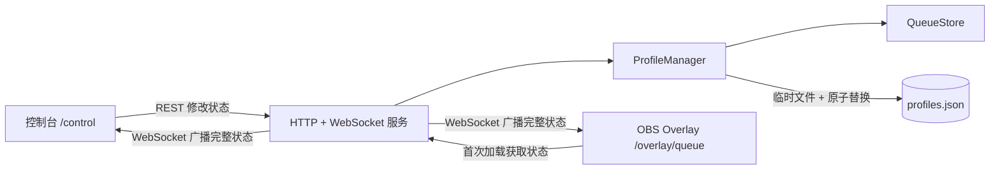

# OBS Live Overlay 设计说明

## 目标

本项目为 OBS Browser Source 提供一个本地实时等候队列。主播通过控制台维护队列和显示样式，Overlay 页面接收同一份状态并立即更新画面。

项目采用 Node.js、TypeScript 和原生 Web 技术实现，不依赖前端框架，主要目标是部署简单、状态可靠、OBS 画面透明且响应及时。

## 系统结构

| 模块 | 职责 |
| --- | --- |
| `src/server.ts` | 提供静态页面、REST API 和 WebSocket 广播 |
| `src/queue-store.ts` | 管理队列、当前用户、显示内容和字体设置，并负责输入校验 |
| `src/profile-manager.ts` | 管理多套配置、串行化写入并持久化 JSON 数据 |
| `src/cli.ts` | 解析命令行参数，启动和关闭服务 |
| `src/startup.ts` | 在 Windows 上管理静默启动计划任务 |
| `public/control.*` | 控制台界面与操作逻辑 |
| `public/overlay.*` | OBS 透明画面、增量 DOM 更新和样式渲染 |

## 状态同步原理

1. 控制台加载后通过 REST 获取当前 Profile 和队列状态。
2. 用户操作通过 REST API 提交到服务端。
3. `QueueStore` 校验并更新内存状态；实际发生变化时递增 `revision`。
4. `ProfileManager` 将更新写入临时文件，再原子替换正式数据文件。
5. 服务端通过 WebSocket 向控制台和 Overlay 广播完整状态。
6. Overlay 根据最新状态复用、插入或删除队列 DOM 节点，并更新 CSS 变量。

广播完整状态而不是操作事件，可以让新连接、断线重连和多页面同步共用同一套逻辑，避免客户端重放事件导致状态漂移。

## 核心数据设计

每个 Profile 独立保存以下内容：

- 队列成员及当前上号用户；
- 是否停止排队和临时提示消息；
- 队列标题、停止排队文案；
- 标题、消息、停止提示和队列四个区域的字体样式；
- 用于标识状态变化的 `revision`。

`currentId` 与数组顺序分离，因此临时指定当前用户不会重排队列。当前用户出队后，优先选择其原位置的下一位，再回到队首。

字体样式以结构化字段保存。描边由 `outlineEnabled` 独立控制，颜色和宽度仅描述开启后的效果。Profile 数据包含格式版本；加载旧版本时会补充缺失字段并迁移旧描边设置。

## 接口划分

| 路径 | 用途 |
| --- | --- |
| `GET /api/overlays/queue/state` | 获取当前完整状态 |
| `/api/overlays/queue/items`、`dequeue`、`current` | 入队、当前用户出队、指定当前用户 |
| `/api/overlays/queue/message`、`stopped`、`content/*` | 修改提示状态和固定文案 |
| `/api/overlays/queue/typography/*` | 修改指定区域的字体样式 |
| `/api/profiles`、`/api/profiles/active` | 创建、管理和切换 Profile |
| `GET /ws` | 接收初始状态和后续状态广播 |

所有写操作在服务端完成校验。业务校验错误、重复数据和资源不存在分别返回对应的 HTTP 状态码。

## Overlay 渲染

Overlay 页面保持透明背景，适合作为 OBS Browser Source 直接叠加。字体设置转换为 CSS 自定义属性，内容节点共享文字颜色和描边渲染规则。

队列更新采用增量 DOM 对比：已有成员复用节点，新成员播放进入动画，离队成员使用副本播放退出动画。排序变化通过元素更新前后的坐标差生成位移动画；系统启用“减少动态效果”时跳过移动动画。

## 持久化与运行方式

默认数据保存在用户应用数据目录，也可通过 `--data-file` 指定路径。Profile 写操作在进程内串行执行，写盘采用“临时文件写入 → 重命名替换”，降低并发覆盖和写入中断造成文件损坏的风险。

服务默认只监听 `127.0.0.1:3000`。Windows 静默启动使用当前用户计划任务拉起隐藏进程；普通运行则由 CLI 捕获退出信号，关闭 HTTP 和 WebSocket 连接后结束进程。

## 设计边界

- 面向单机、单主播和可信本地网络环境，不提供账号或权限系统。
- 服务端内存状态是运行时真相，JSON 文件用于重启恢复，不作为外部实时数据库。
- Overlay 只负责展示，不直接修改业务状态。
- 新功能应优先扩展现有状态、REST 更新和 WebSocket 全量广播链路，避免引入第二套同步机制。
